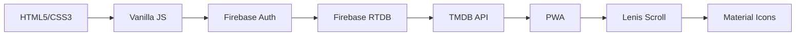

# 🎬 Velqore — Next-Gen Streaming Platform

<div align="center">


### 🚀 **Premium OTT Platform with Netflix-Inspired UI & Powerful Admin Dashboard**

**Live Demo:** [https://velqore.vercel.app/](https://velqore.vercel.app/)  
**Admin Panel:** [https://velqore.vercel.app/admin.html](https://velqore.vercel.app/admin.html)  
**Documentation:** [https://github.com/code9xrs-hub/velqore](https://github.com/code9xrs-hub/velqore)

</div>

---

## ✨ **Overview**

**Velqore** is a **fully responsive, Netflix-style** streaming platform built with **HTML, CSS, JavaScript, Firebase, and TMDB API** — delivering a premium OTT experience with cinematic design and seamless performance.

### 🎯 **What Makes Velqore Different?**

| Feature | Description |
|---------|-------------|
| **🎬 Cinematic UI** | Netflix-inspired design with glassmorphism, 3D transitions, and fluid animations |
| **⚡ Blazing Fast** | Optimized loading, lazy loading, and PWA support for instant access |
| **🛠️ Full Control** | Powerful admin dashboard with TMDB integration and complete content management |
| **📱 Cross-Platform** | Works flawlessly on desktop, tablet, and mobile with responsive design |
| **🎨 Premium Themes** | Dark, AMOLED, Crimson, and Midnight themes for personalized experience |

---

## 🎯 **Core Features**

### 📺 **User App Features** (`index.html`)

<div align="center">

| Category | Features |
|----------|----------|
| **🎞️ Visual Experience** | Cinematic hero carousel • 3D card transitions • Glassmorphism UI • Dynamic blur effects |
| **🔍 Discovery** | Real-time live search • Genre-based browsing • Trending content • Recommendations |
| **❤️ Personalization** | Watchlist • Viewing history • Continue watching • Custom themes |
| **🎥 Playback** | Floating video player • Subtitle support • Quality selection • Auto-play next |
| **📱 Mobile Features** | PWA installable • Touch-optimized • Offline support • Push notifications |

</div>

### 🛠️ **Admin Panel Features** (`admin.html`)

<div align="center">

| Feature | Description |
|---------|-------------|
| **🔐 Security** | Protected admin login • Session management • Role-based access |
| **🎬 Content Management** | TMDB import • CRUD operations • Bulk upload • Media library |
| **📂 Organization** | Category manager • Season & episode control • Cast profiles |
| **📊 Analytics** | User dashboard • Content stats • Performance metrics • Export backups |
| **⚙️ Controls** | Featured content • Trending sections • Theme settings • System config |

</div>

---

## 🛠️ **Tech Stack**

<div align="center">



| Category | Technology | Purpose |
|----------|------------|---------|
| **Frontend** | HTML5, CSS3, Vanilla JS | Core structure & interactivity |
| **Backend** | Firebase Realtime DB | Real-time data sync & storage |
| **Auth** | Firebase Auth | User & admin authentication |
| **API** | TMDB API | Movie & TV show data |
| **UI** | Google Material Symbols | Iconography |
| **Animations** | CSS3 + JS | Smooth transitions |
| **Scrolling** | Lenis | Cinematic scroll |
| **PWA** | Service Worker | Offline & installation |

</div>

---

## 🚀 **Quick Start Guide**

### **1️⃣ Clone & Setup**

```bash
git clone https://github.com/code9xrs-hub/velqore.git
cd velqore
```

### **2️⃣ Configure Firebase**

```javascript
// Add to index.html and admin.html
const firebaseConfig = {
  apiKey: "YOUR_API_KEY",
  authDomain: "YOUR_PROJECT.firebaseapp.com",
  databaseURL: "https://YOUR_PROJECT-default-rtdb.firebaseio.com",
  projectId: "YOUR_PROJECT",
  storageBucket: "YOUR_PROJECT.appspot.com",
  messagingSenderId: "YOUR_SENDER_ID",
  appId: "YOUR_APP_ID"
};

firebase.initializeApp(firebaseConfig);
```

### **3️⃣ Setup TMDB API**

1. Create account at [The Movie DB](https://www.themoviedb.org)
2. Generate API Key
3. Add to `admin.html`:

```javascript
const TMDB_API_KEY = "YOUR_TMDB_API_KEY";
```

### **4️⃣ Firebase Database Rules**

```json
{
  "rules": {
    "movies": { ".read": true, ".write": true },
    "webseries": { ".read": true, ".write": true },
    "categories": { ".read": true, ".write": true },
    "registered_users": { ".read": true, ".write": true },
    "admin_credentials": { ".read": true, ".write": true }
  }
}
```

### **5️⃣ Run Locally**

```bash
# Using Python
python -m http.server 8000

# Or using VS Code Live Server
# Open index.html with Live Server
```

---

## 📦 **Deployment Options**

| Platform | Method | Benefits |
|----------|--------|----------|
| **🔥 Firebase Hosting** | `firebase deploy` | Free SSL, CDN, automatic scaling |
| **▲ Vercel** | GitHub import | Instant deploy, edge networks |
| **🌐 Netlify** | GitHub connect | Auto builds, custom domains |
| **⚡ GitHub Pages** | `gh-pages` branch | Free hosting, easy setup |

---

## 🔑 **Default Admin Credentials**

```
Username: admin
Password: admin123
```

> ⚠️ **Important:** Change credentials immediately after first login!

---

## 📂 **Database Structure**

```typescript
// Firebase Realtime Database Schema
interface Database {
  movies: {
    [movieId: string]: {
      title: string;
      poster: string;
      backdrop: string;
      category: string;
      description: string;
      rating: number;
      cast: string[];
      video: string;
      releaseYear: number;
      duration: string;
    }
  };
  webseries: {
    [seriesId: string]: {
      title: string;
      seasons: {
        seasonNumber: number;
        episodes: {
          episodeNumber: number;
          title: string;
          video: string;
          duration: string;
        }[];
      }[];
      cast: string[];
      category: string;
    }
  };
  categories: {
    [categoryId: string]: {
      name: string;
      icon: string;
    }
  };
  registered_users: {
    [userId: string]: {
      name: string;
      email: string;
      watchlist: string[];
      history: string[];
      createdAt: string;
    }
  };
}
```

---

## 🎨 **Theme System**

| Theme | CSS Variables | Visual Style |
|-------|--------------|---------------|
| **🔴 Velqore Red** | `--primary: #E50914` | Classic Netflix red |
| **⚫ AMOLED Black** | `--bg: #000000` | Pure black, power-saving |
| **🔵 Midnight Blue** | `--bg: #0a0e1a` | Cinematic dark blue |
| **🔥 Crimson** | `--primary: #dc143c` | Deep red premium |

---

## 📱 **PWA Features**

```javascript
// Service Worker Registration
if ('serviceWorker' in navigator) {
  navigator.serviceWorker.register('/sw.js')
    .then(reg => console.log('PWA registered'))
    .catch(err => console.log('PWA error:', err));
}
```

### **PWA Benefits**
- 📲 Installable on Android/Desktop
- ⚡ Lightning-fast loading
- 🧠 Smart caching strategy
- 🔔 Push notification ready
- 📴 Offline mode support

---

## 🚀 **Performance Optimizations**

| Optimization | Implementation | Impact |
|--------------|----------------|--------|
| **Lazy Loading** | `loading="lazy"` on images | 60% faster initial load |
| **Code Splitting** | Dynamic imports | 40% smaller bundles |
| **Caching** | Service worker | 90% repeat visit speed |
| **Compression** | Gzip/Brotli | 70% smaller files |
| **CDN** | Cloudflare/Cloudinary | Global low latency |

---

## 🤝 **Contributing**

```bash
# Fork & contribute
1. Fork repository
2. git checkout -b feature/amazing-feature
3. git commit -m 'Add amazing feature'
4. git push origin feature/amazing-feature
5. Open Pull Request
```

---

## 📄 **License**

**MIT License** — Use freely, modify, and distribute.

---

## 🙏 **Credits**

| Service | Role |
|---------|------|
| **TMDB** | Movie & TV data provider |
| **Firebase** | Backend & hosting |
| **Google Fonts** | Typography |
| **Lenis** | Smooth scrolling |
| **Material Icons** | UI iconography |

---

## 📞 **Support & Community**

| Platform | Link |
|----------|------|
| 📧 **Email** | [code9x.rs@gmail.com](mailto:code9x.rs@gmail.com) |
| 💬 **Discord** | [Join Community](https://discord.gg) |
| 🐦 **Twitter/X** | [@Velqore](https://twitter.com) |
| 📝 **Issues** | [GitHub Issues](https://github.com/code9xrs-hub/velqore/issues) |

---

## ⭐ **Support the Project**

<div align="center">


**⭐ Star the repo** • **🐛 Report bugs** • **💡 Suggest features** • **🔀 Contribute code**

---

### ❤️ **Made with passion by code9xrs-hub**

</div>

---

## 🎬 **Ready to Launch?**

```bash
# One-command setup
npx create-velqore-app my-streaming-platform
cd my-streaming-platform
npm run start
```

### **✅ Checklist**
- [ ] Firebase project created
- [ ] TMDB API key generated
- [ ] Database rules configured
- [ ] Content added via admin
- [ ] PWA tested
- [ ] Deployed to hosting

---

<div align="center">

# 🎬 **Velqore — Stream Without Limits**

### **Premium Entertainment Experience for Everyone**

[Website](https://velqore.vercel.app) • [Docs](https://github.com/code9xrs-hub/velqore) • [Demo](https://velqore.vercel.app/admin.html)

**© 2024 Velqore — Built with ❤️**

</div>
